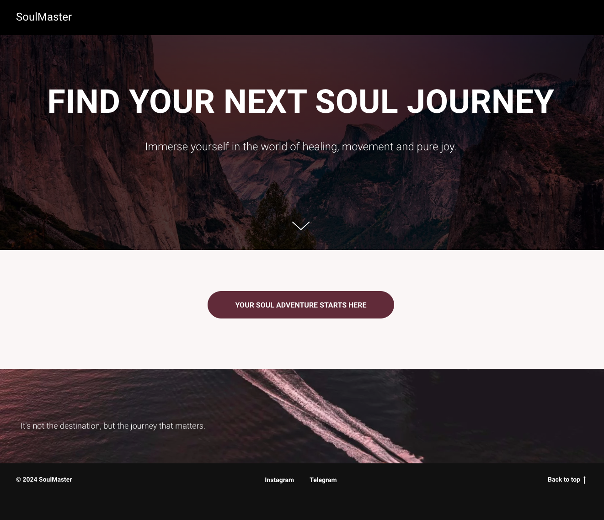
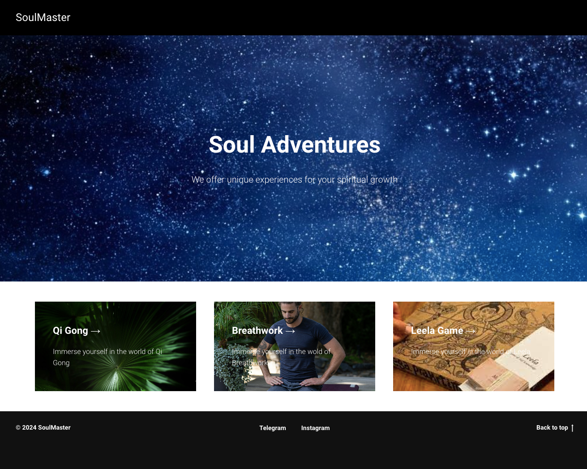
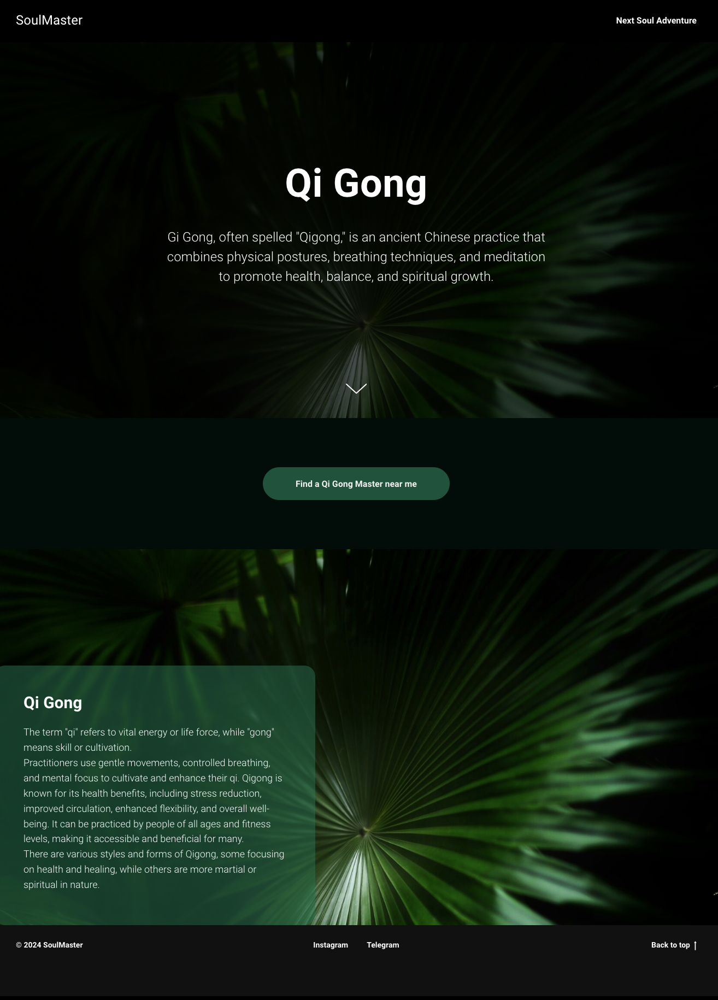
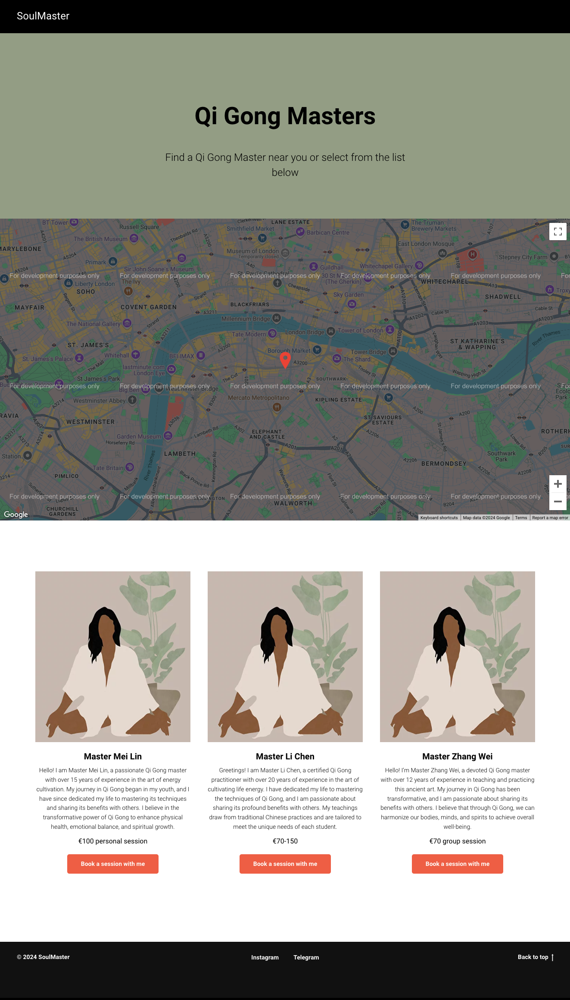
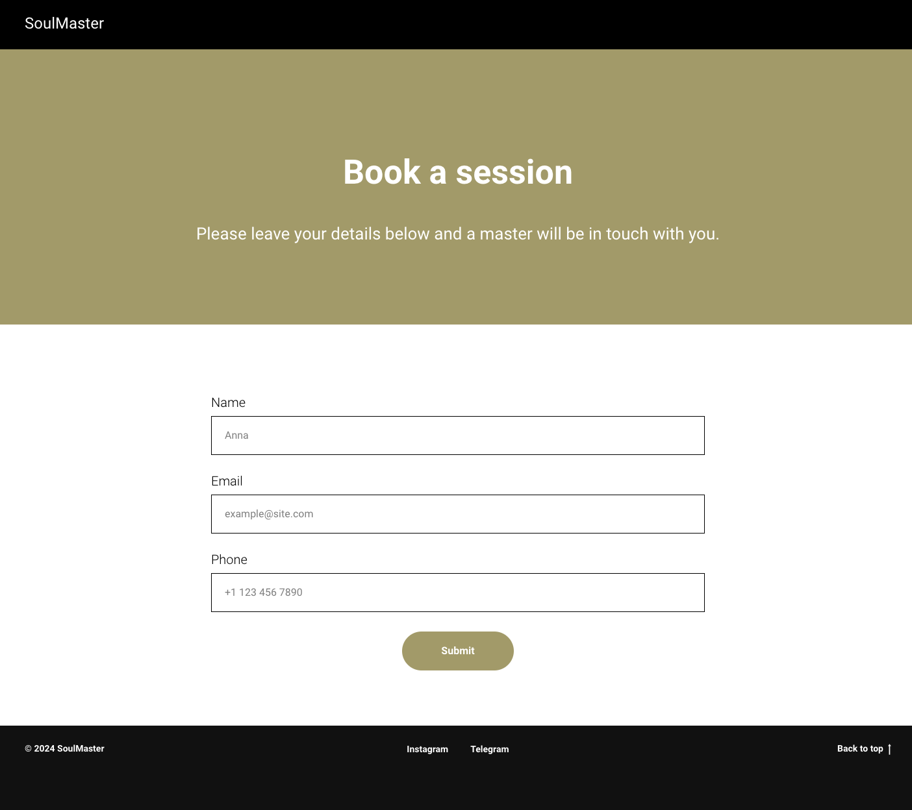

# Project Title

SoulMaster

## Overview

SoulMaster is an online platform that connects customers with practitioners & masters offering unique sessions in spirituality and healing.

### Problem

Currently many practioners offering unique services within spirituality and healing fields have to post their advertisement pamphlets on the boards in coffee shops and other community centers as there is no platform on the market that would offer space for that niche category. Some of them create their own websites but it's costly and time-consuming. They also still have to promote their websites using other platforms. Therefore, their market outreach is limited and usually bound to a specific location. Some practitioners promote themselves using instagram and are quite successful, but you have to follow their account in order to know what services they offer & to be able to book a session with them. They could still benefit from an online platform as it can help increase their client base.

### User Profile

- Adventurous individuals seeking a new experience/healing:
  - looking for a practitioner close to their current location
  - looking for a unique experience when travelling
  - want to benefit from the consolidated view of all practitioners to be able to compare & select
  - want to discover unique services that are being offered apart from mainstream
  - want to experience new things while travelling

### Features

- A a user, I want to be able to view a catalog of adventures
- As a user, I want to be able to select a spiritual adventure that interests me and get more details about it
- As a user, I want to be able to select a master from the list of available masters
- As a user, I want to be able to view details of the selected master
- As a user, I want to be able to contact a selected master in order to book an appointment
- As a user, I want to receive an update that my contact details were sucessfully sent to a selected master

## Implementation

### Tech Stack

- React
- Express
- Client libraries:
  - react
  - react-router
  - axios
- Server libraries:
  - express

### APIs

- I will use JSON file on back-end to send data to the front-end and receive data from the front-end
- No external APIs will be used for this project

### Sitemap

- Landing page
- List soul adventures
- View details of the selected adventure
- View a list of masters
- View details of the selected master
- Contact master form

### Mockups

#### Home Page



#### Soul Adventures Page



#### Selected Adventure Page



#### Master Selection Page



#### Master Details Page


#### Contact Master Page



### Data

Display list of adventures -> API call to get data from the JSON file on the back-end
Display details of the selected adventure -> API call to retrieve selected adventure details
Display list of masters -> API call to get data from the JSON file on the back-end
Display a description of the selected master -> API call to retrieve individual master details

Potentially might not be required:
Store client contact information -> API call to store client details on the back-end

### Endpoints

**GET /adventures**

- Get adventures

Parameters:

N/A

Response:

```
[
    {
        "id": 1,
        "activity": "Qi Gong",
        "image": "image.png",
    },
    ...
]
```

**GET /adventures/:id**

- Get adventures by id

Parameters:

- id: Activity id as number

Response:

```
{
    "id": 1,
    "activity": "Qi Gong",
    "top_description": "Gi Gong, often spelled "Qigong," is an ancient Chinese practice that combines physical postures, breathing techniques, and meditation to promote health, balance, and spiritual growth.",
    "top_image": "image.png",
    "bottom_description": "The term "qi" refers to vital energy or life force, while "gong" means skill or cultivation. Practitioners use gentle movements, controlled breathing, and mental focus to cultivate and enhance their qi. Qigong is known for its health benefits, including stress reduction, improved circulation, enhanced flexibility, and overall well-being. It can be practiced by people of all ages and fitness levels, making it accessible and beneficial for many. There are various styles and forms of Qigong, some focusing on health and healing, while others are more martial or spiritual in nature.",
    "botton_image": "image.png",
}
```

**GET /masters**

- Get masters

Parameters:

- Activity: User-selected adventure as a string

Response:

```
[
    {
        "id": 1,
        "name": "Mei Lin",
        "description": Hello! I am Master Mei Lin, a passionate Qi Gong master with over 15 years of experience in the art of energy cultivation. My journey in Qi Gong began in my youth, and I have since dedicated my life to mastering its techniques and sharing its benefits with others. I believe in the transformative power of Qi Gong to enhance physical health, emotional balance, and spiritual growth",
        "price": 100,
        "currency": "€",
        "type": "personal session",
    },
    ...
]
```

**GET /masters/:id**

- Get masters by id

Parameters:

- id: Master id as number
- Activity: User-selected adventure as a string

Response:

```
{
    "id": 1,
    "name": "Mei Lin",
    "text": "Personalized Qi Gong Sessions: Whether you're a beginner or an experienced practitioner, I will guide you through customized sessions that focus on your individual goals, be it stress relief, increased energy, or improved flexibility. Group Classes: Join a community of like-minded individuals in my group classes, where we practice various Qi Gong forms, breathing techniques, and meditation exercises. Together, we will cultivate a sense of harmony and balance. Workshops and Retreats: Experience deeper immersion through my workshops and retreats, designed to enhance your understanding and practice of Qi Gong in a serene environment. Online Sessions: For those who prefer practicing at home, I offer virtual classes that allow you to connect and learn from the comfort of your own space.",
    "price": 100,
    "currency": "€",
    "type": "personal session",
}
```

Not sure yet if I will need to store client data. If not, I won't need an API call below.

**POST /clients**

- User can contact a selected master

Parameters:

- Name: Anna
- Email: example@site.com
- Phone: +11234567890

Response:

```
{
    "id": 1,
    "master_name": "Mei Lin",
    "activity": "qigong",
    "name": "Anna",
    "email": "example@site.com",
    "phone": "+11234567890",
}
```

## Roadmap

- Create client

  - react project with routes and pages

- Create server

  - express project with routing, with placeholder 200 responses

- Create JSON file for adventures

- Create JSON file for masters

- Deploy client and server projects so all commits will be reflected in production

- Feature: Home page

- Feature: List spiritual adventures

  - Implement soul adventures page
  - Create GET /adventures endpoint

- Feature: View details of the selected adventure

  - Implement selected adventure page
  - Store selected adventure in sessionStorage
  - Create GET /adventures/:id

- Feature: View a list of masters

  - Implement master selection page
  - Create GET /masters endpoint

- Feature: View details of the selected master

  - Implement master details page
  - Store selected master in sessionStorage
  - Create GET /masters/:id endpoint

- Feature: Contact a selected master

  - Implement contact master page
  - Add form input & validation to the page
  - Create POST /clients endpoint (Potentially might not be required)

- Bug fixes

- DEMO DAY

## Nice-to-haves

- Google Maps API to view masters near me or in a given location
- Email notification sent to masters once someone requests an appointment with them
- Ability to add a new master
- Sort list of masters based on the country/location
- SQL database
- Proper error screens/handling
- Navigation bar
- Unit and Integration Tests
- Form for users/masters to suggest a new adventure to be added to the platform
- Adventure selection based on the input from the user (preferences, location etc.)
- Master's availability calendar & booking system
- Payment done via platform using 3rd party vendors
- Faculitator Trainings catalog
- Retreat catalog
- Events catalog
